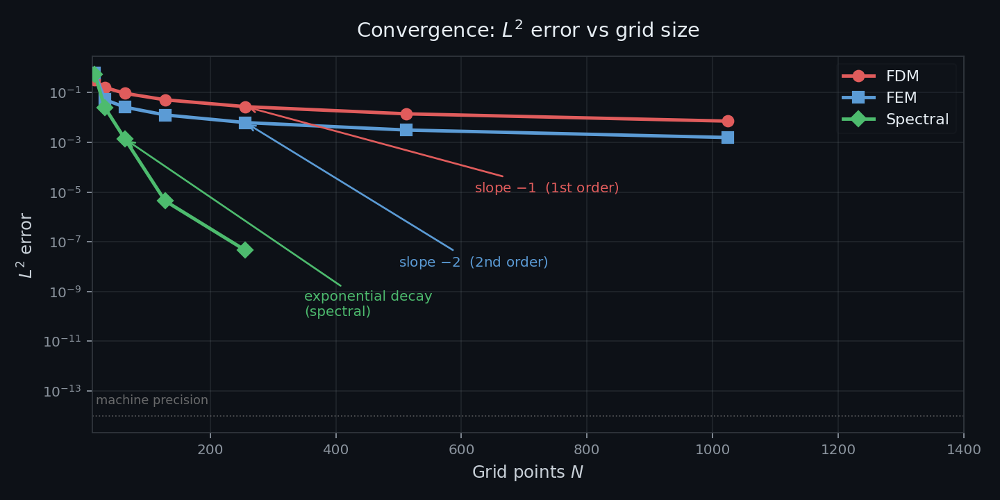
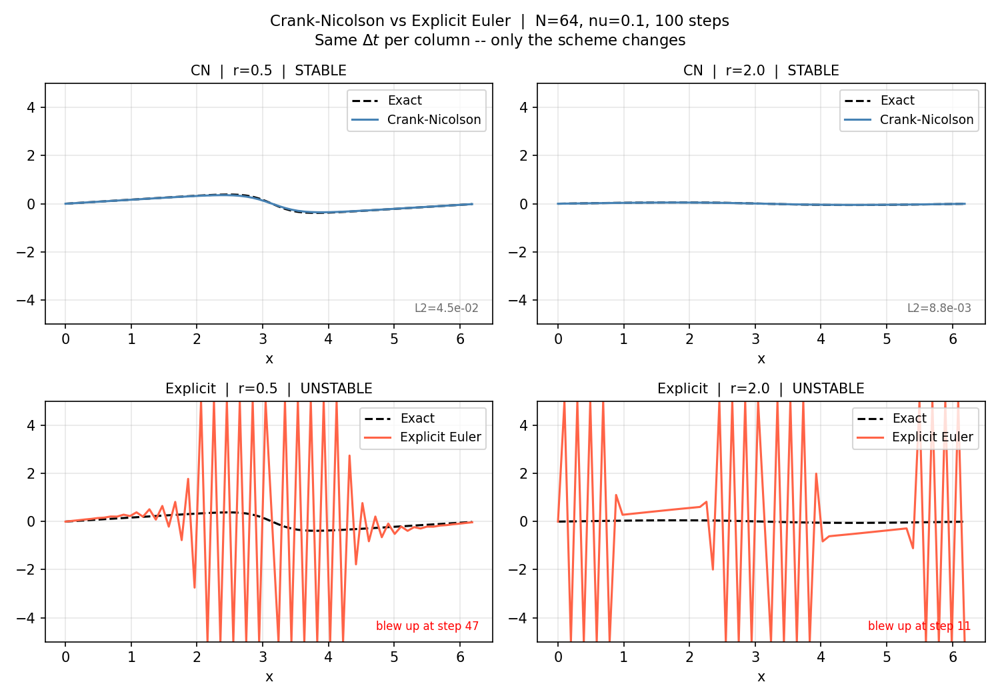
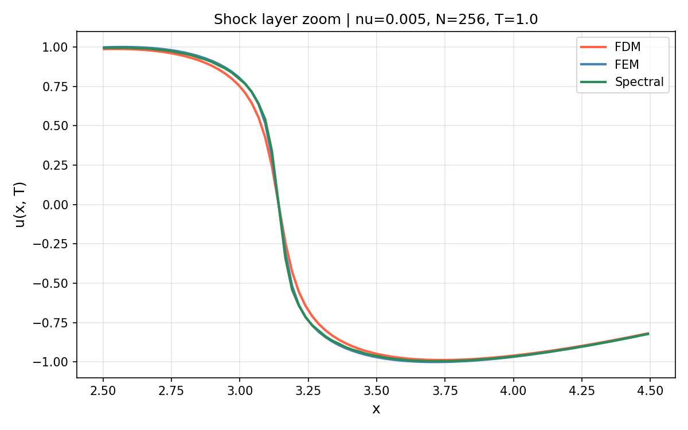
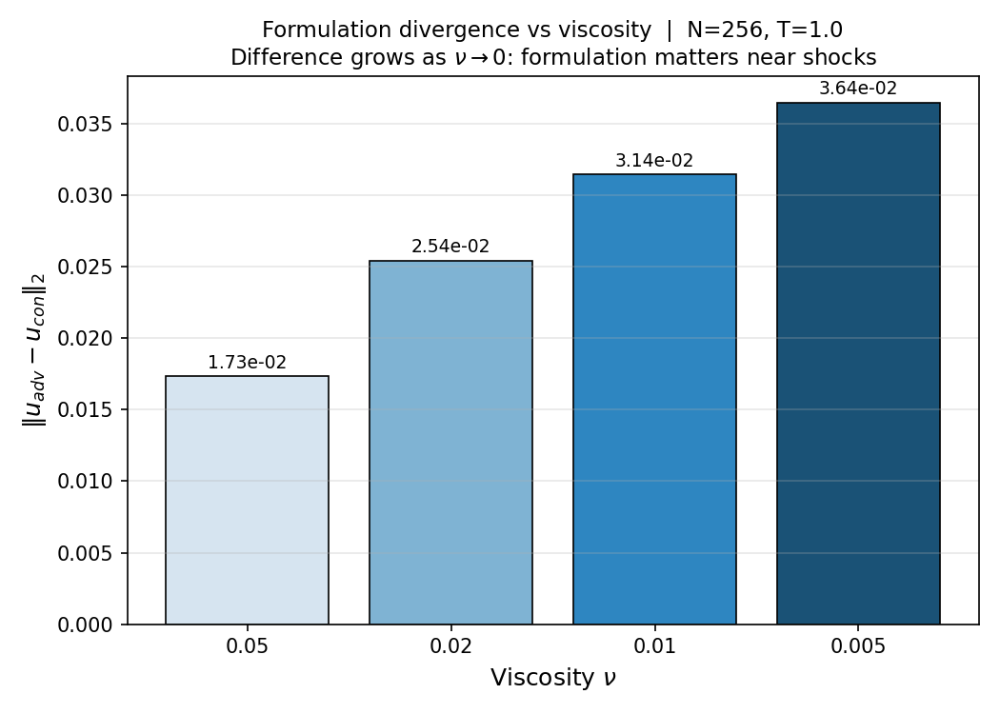

# Three Roads to Burgers: Finite Difference, Finite Element, and Spectral Methods Under Smooth and Shock Regimes

A comparative study of **Finite Difference (FDM)**, **Finite Element (FEM)**, and **Fourier Spectral** methods applied to the viscous Burgers equation.

---

## How This Project Came About

My PhD work on Maxwell equations in metamaterials introduced me to spectral analysis through the modal structure of the problem --- studying how electromagnetic modes behave in materials with unusual dispersive properties. That work was largely analytical, but it sat right at the boundary between mathematics and computation, and it left me curious about the numerical side of things I had mostly sidestepped.

After finishing the thesis I wanted to close that gap. Numerical methods had always been adjacent to my work but never the focus of it. I knew enough to use them, but not enough to understand them from first principles --- what makes one method more accurate than another, why some schemes blow up while others do not, and how the mathematical properties of a method connect to their practical behaviour on real problems.

The Burgers equation was the natural choice for this investigation. It is the simplest nonlinear PDE that develops a shock-like structure, it has an exact solution via the Cole-Hopf transformation (which itself has a spectral character that felt familiar from the Maxwell work), and it is 1D --- tractable enough to run thorough studies without requiring a cluster. The direct inspiration for the comparative structure of this project is Basdevant et al. (1986), *Spectral and finite difference solutions of the Burgers equation*, which systematically compared spectral and finite difference approaches on this same problem and established many of the benchmarks used here.

---

## What Problem It Hopes to Solve

This is not a library meant to solve Burgers in production. The goal is more specific: to build a controlled environment where three classical methods can be compared honestly and in detail --- not just in terms of final accuracy, but in terms of how they fail, how they scale, and what tradeoffs they force.

The question driving the project is: **given a fixed computational budget, which method gives the most accuracy, and under what conditions does that answer change?**

For smooth solutions the answer is unambiguous --- spectral methods are exponentially more accurate than any algebraic method. For near-shock solutions the answer reverses completely. Understanding why requires looking at the methods from the inside, not just benchmarking them.

This project is ultimately about building that understanding rigorously, and making the reasoning transparent enough that someone else working through the code and notebook can build it too.

---

## The PDE

$$u_t + u\,u_x = \nu\,u_{xx}, \quad x \in [0,\,2\pi], \quad u(x,0) = \sin(x)$$

The parameter $\nu > 0$ is the kinematic viscosity. For large $\nu$ the solution stays smooth. For small $\nu$ a steep layer of width $\delta \sim \nu/|u|$ develops near $x = \pi$, mimicking the structure of a shock.

---

## Methods Implemented

| Method | Spatial discretisation | Time scheme | Convergence (smooth) |
|---|---|---|---|
| **FDM** | Upwind finite differences | Crank-Nicolson | $O(1/N)$ |
| **FEM** | Galerkin P1 elements | Crank-Nicolson | $O(1/N^2)$ |
| **Spectral** | Fourier pseudospectral + 2/3 dealiasing | Integrating factor RK4 | Exponential |

---


> **Reading the figure.** FDM and FEM show algebraic decay — each doubling of $N$ reduces the error by a fixed factor. The spectral method decays exponentially: the error drops faster than any fixed slope until it reaches floating-point machine precision (~1e-14) around $N=512$. Beyond that point the computed error is indistinguishable from zero and is stored as `NaN` in the results — the curve ends not because the solver fails, but because there is nothing left to measure.
> 
## Key Results

- Spectral hits machine precision ($\sim 10^{-14}$) at $N=128$ for smooth data
- FEM is $10\times$ more accurate than FDM at the same grid size
- Near shocks ($\nu=0.005$): FDM smears, FEM oscillates, Spectral rings (Gibbs)
- Crank-Nicolson is unconditionally stable; explicit Euler blows up at $r = \nu\,\Delta t/\Delta x^2 > 0.5$
- Memory is $O(N)$ for all methods; FEM runtime grows super-linearly due to Python loop overhead in element assembly
- **Formulation matters near shocks**: the conservative and advective forms of the FDM agree for smooth solutions but diverge as $\nu \to 0$; the conservative form more faithfully preserves the conservation structure governing shock propagation, producing a sharper, physically consistent shock profile, while the advective form introduces different numerical smearing; for the symmetric $\sin(x)$ initial condition the shock position is the same in both (shock speed $s=0$ by symmetry), but the profile shape and smearing width diverge as $\nu \to 0$

---

## Challenges and Limitations

**Exact solution reliability.** The Cole-Hopf transformation requires computing $e^{-\nu k^2 t}$ for all wavenumbers $k$. For small $\nu$ the normalisation of $\phi$ must be handled carefully to avoid $0/0$ in the ratio $u = -2\nu\,\phi_x/\phi$. A normalisation fix is documented in the code. For $\nu \leq 0.01$ the exact solution itself becomes unreliable at $T=1$, so error comparisons are only shown for $\nu \geq 0.05$.

**Spectral solver overflow.** The integrating factor $e^{\nu k^2 t}$ overflows for large $k$ at late times. The fix was to compute it only for active (non-dealiased) modes and set the rest to zero, since the 2/3 rule zeros those modes anyway.

**Stability demonstration.** Showing numerical instability is harder than expected when the production scheme (Crank-Nicolson) is unconditionally stable. A naive attempt to violate the CFL condition simply does not blow up. The instability study required switching to a fully explicit scheme to expose the Von Neumann diffusion constraint $r \leq 0.5$, and using a fixed step count so the instability has enough iterations to grow. The final figure shows CN and explicit Euler at the same $\Delta t$ side by side --- the contrast is the point.



> **Reading the figure.** Both columns use the exact same $\Delta t$, only the scheme changes. Top row: Crank-Nicolson stays stable and tracks the exact solution regardless of $r$. Bottom row: explicit Euler blows up at step 47 ($r=0.5$, right at the theoretical limit) and step 11 ($r=2.0$). The high-frequency oscillations filling the domain are the classic signature of a Von Neumann unstable scheme.

**FEM performance.** The convection vector assembly uses a Python loop over elements. This is the correct pedagogical implementation but is slow at large $N$. It is documented as a known limitation rather than fixed, to keep the FEM code readable.

**Viscosity range.** The comparative study is restricted to $\nu \geq 5 \times 10^{-3}$. For smaller values the Cole-Hopf reference solution becomes numerically ill-conditioned due to loss of floating-point resolution in the normalisation of the transformed variable. Extending the study into this regime would require switching to either a manufactured solution framework or a sufficiently resolved numerical reference solution.



> **Reading the figure.** At $\nu=0.005$ all three methods struggle near the shock layer. FDM smears it (artificial viscosity), FEM develops spurious oscillations (no upwinding), and the spectral method rings (Gibbs phenomenon). The exact solution overlay is omitted here because its Fourier representation is itself unreliable at this viscosity.

**Conservative vs advective formulation.** The viscous Burgers equation can be written as $u_t + u\,u_x = \nu\,u_{xx}$ (advective) or equivalently as $u_t + \partial(u^2/2)/\partial x = \nu\,u_{xx}$ (conservative). For sufficiently smooth solutions the two formulations lead to equivalent truncation errors under standard discretisations. In the near-shock regime, however, the conservative form more faithfully preserves the conservation structure governing shock propagation, while the advective form resolves the shock layer differently, producing a different profile shape and smearing width; for the symmetric $\sin(x)$ initial condition both formulations place the shock at the same position ($s=0$ by symmetry), but the profile diverges as $\nu \to 0$.



> **Reading the figure.** Each bar is the $L^2$ norm of $(u_\text{advective} - u_\text{conservative})$ at $T=1$ for a fixed viscosity. The difference is negligible at $\nu=0.05$ (smooth solution) and grows by roughly an order of magnitude at $\nu=0.005$ (near-shock). This is the canonical argument for why conservation-law solvers are preferred in shock-dominated flows.

---

## Repo Structure

```
burgers-pde-solvers/
  solvers/
    exact.py        Cole-Hopf exact solution
    fdm.py          Finite difference solver
    fem.py          Finite element solver
    spectral.py     Fourier pseudospectral solver
  analysis/
    convergence.py   L2 error vs N for all three methods
    performance.py   Runtime and memory scaling
    shock.py         Shock resolution study
    cfl.py           CN vs explicit Euler stability contrast
    formulation.py   Conservative vs advective FDM formulation
  tests/
    test_exact.py
    test_fdm.py
    test_fem.py
    test_spectral.py
  notebooks/
    main.ipynb      Full narrative walkthrough
  figures/          All generated figures
  results/          convergence.csv, performance.csv
  app.py            Streamlit interactive app
```

---

## Quickstart

### General (venv)

```bash
git clone https://github.com/alex-rosas/burgers-pde-solvers
cd burgers-pde-solvers
python -m venv .venv
source .venv/bin/activate        # Windows: .venv\Scripts\activate
pip install -r requirements.txt
export PYTHONPATH=$(pwd)         # Windows: set PYTHONPATH=%cd%
```

### Conda

```bash
git clone https://github.com/alex-rosas/burgers-pde-solvers
cd burgers-pde-solvers
conda create -n burgers python=3.11
conda activate burgers
pip install -r requirements.txt
conda env config vars set PYTHONPATH="$(pwd)"
conda activate burgers           # re-activate to apply the variable
```

### Running the project

```bash
# Analysis scripts (run from project root)
python analysis/convergence.py
python analysis/performance.py
python analysis/shock.py
python analysis/cfl.py
python analysis/formulation.py

# Tests
pytest tests/

# Interactive app
streamlit run app.py

# Narrative notebook
jupyter notebook notebooks/main.ipynb
```

---

## Dependencies

```
numpy
scipy
matplotlib
pandas
streamlit
jupyter
pytest
```

Full list in `requirements.txt`.

---

## References

**Direct inspiration for the comparative study**

- Basdevant, C., Deville, M., Haldenwang, P., Lacroix, J. M., Ouazzani, J., Peyret, R., Orlandi, P., & Patera, A. T. (1986). Spectral and finite difference solutions of the Burgers equation. *Computers & Fluids*, 14(1), 23-41.

**Finite difference methods**

- LeVeque, R. J. (2007). *Finite Difference Methods for Ordinary and Partial Differential Equations.* SIAM.
- Strikwerda, J. C. (2004). *Finite Difference Schemes and Partial Differential Equations.* SIAM.

**Finite element methods**

- Brenner, S. C., & Scott, L. R. (2008). *The Mathematical Theory of Finite Element Methods* (3rd ed.). Springer.
- Johnson, C. (1987). *Numerical Solution of Partial Differential Equations by the Finite Element Method.* Cambridge University Press.

**Spectral methods**

- Trefethen, L. N. (2000). *Spectral Methods in MATLAB.* SIAM.
- Canuto, C., Hussaini, M. Y., Quarteroni, A., & Zang, T. A. (1988). *Spectral Methods in Fluid Dynamics.* Springer.

**Burgers equation and exact solution**

- Whitham, G. B. (1999). *Linear and Nonlinear Waves.* Wiley.
- Cole, J. D. (1951). On a quasi-linear parabolic equation occurring in aerodynamics. *Quarterly of Applied Mathematics*, 9(3), 225-236.
- Hopf, E. (1950). The partial differential equation $u_t + u\,u_x = \mu\,u_{xx}$. *Communications on Pure and Applied Mathematics*, 3(3), 201-230.

---

## License

MIT
